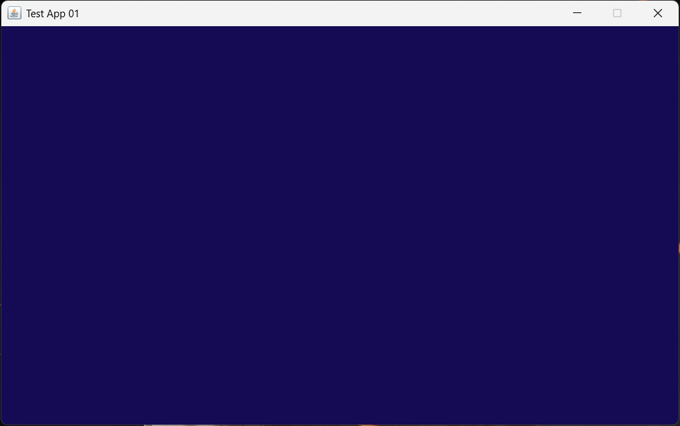

# 🖥️ Test App 01

A simple Java GUI application built using **Java Swing**. This project creates a basic application window and demonstrates how to configure a `JFrame`, including its title, size, background color, position, resizing behavior, and closing operation.

---

## 📋 Features

* Creates a graphical application window
* Sets a custom window title
* Sets a fixed window size
* Prevents window resizing
* Centers the window on the screen
* Sets a custom background color
* Configures the application close operation
* Uses Java Swing for GUI development

---

## 🛠️ Technologies Used

* Java
* Java Swing
* `JFrame`
* `Color`
* AWT
* Object-Oriented Programming (OOP)

---

## 📂 Project Structure

```text
test-app-01/
│── Main.java
│── MyFrame.java
│── Main.class
│── MyFrame.class
│── images
│   └── screenshot-01.png
└── README.md
```

---

## ▶️ How to Compile and Run

### Compile

```bash
javac Main.java MyFrame.java
```

### Run

```bash
java Main
```

---

## 📖 Usage

1. Compile the Java files.
2. Run the `Main` class.
3. A graphical window will appear.
4. The application window is configured with:

   * Title: `Test App 01`
   * Width: `800px`
   * Height: `500px`
   * Fixed window size
   * Centered screen position
   * Custom background color

---

# 📸 Preview

The application produces a simple GUI window:



---

## 🪟 JFrame Configuration

The `MyFrame` class extends `JFrame` to create the application window.

### Window Title

```java
this.setTitle("Test App 01");
```

Sets the title displayed at the top of the application window.

### Window Size

```java
this.setSize(800, 500);
```

Creates a window with a width of `800px` and a height of `500px`.

### Close Operation

```java
this.setDefaultCloseOperation(JFrame.EXIT_ON_CLOSE);
```

Terminates the application when the window is closed.

### Disable Resizing

```java
this.setResizable(false);
```

Prevents the user from changing the window size.

### Center the Window

```java
this.setLocationRelativeTo(null);
```

Positions the window in the center of the screen.

### Background Color

```java
this.getContentPane().setBackground(new Color(0x140B54));
```

Sets a custom background color for the application window.

### Display the Window

```java
this.setVisible(true);
```

Makes the JFrame visible to the user.

---

## 🧱 Class Structure

```text
        Main
          |
          | creates
          v
       MyFrame
          |
          | extends
          v
       JFrame
```

### `Main` Class

The `Main` class contains the `main()` method and starts the application by creating a `MyFrame` object.

### `MyFrame` Class

The `MyFrame` class extends `JFrame` and is responsible for configuring the graphical application window.

---

## 🎯 Learning Objectives

This project demonstrates:

* Java GUI Development
* Java Swing
* Creating a `JFrame`
* Inheritance using `extends`
* Constructors
* Object Creation
* Window Configuration
* AWT `Color`
* Basic GUI Application Structure
* Using Swing Components

---

## 🚀 Future Improvements

Possible enhancements include:

* Adding `JLabel` components
* Adding `JButton` components
* Adding text fields
* Creating interactive buttons
* Adding images and icons
* Handling button events
* Creating multiple screens
* Building a complete desktop application

---

## 👤 Author

**Namiez Asfar**

GitHub: **https://github.com/namiezasfar7**
